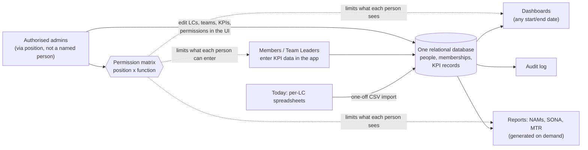
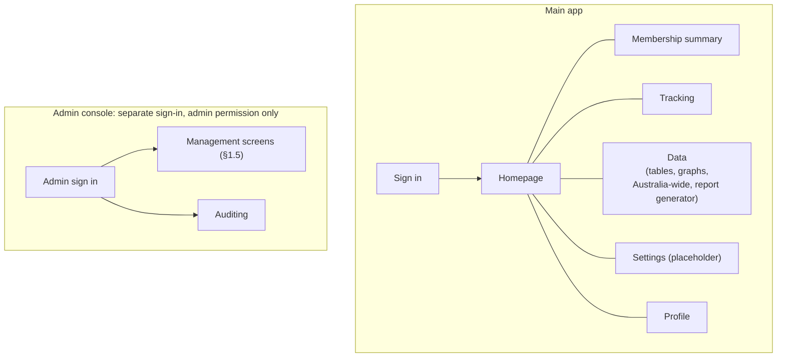

# Membership / Data Management Platform — Requirements Spec

Status: draft · Owner: Tech Lead · Last updated: 2026-09-21

This is the full requirements reference for the Membership / Data Management Platform.
It describes the long-term product vision. Items that are **not** for this term are
marked **[Phase 2]** — design for them, don't build them yet.

Read `CLAUDE.md` first. The governing constraint for every decision in this document
is **annual turnover**: assume whoever built a thing is gone next year and whoever
maintains it has zero prior context.

`TODO:` callouts mark information the team must obtain before the affected part can be
finalised. Nothing behind a `TODO:` has been guessed or invented.

---

## 0. The idea in one page

*Start here. Everything after this section is detail.*

### 0.1 In plain language

Today, each Local Committee (LC) keeps its members and productivity numbers in its
own spreadsheets. To produce an official report (NAMs, SONA, MTR), someone adds those
sheets up by hand. This tool replaces that with **one database** that everyone works
in:

1. **Record things once, at the smallest useful grain.** "Member X did N of KPI Y in
   week Z" is one row. Nobody ever types a total.
2. **Everything else is a query over those rows.** Dashboards and official reports
   are computed on demand for any date range, so they can never disagree with each
   other.
3. **Each person only sees what their role allows.** What you can see and do depends
   on your **position** (e.g. LCP, LCVP, Team Leader, Member) **and** your
   **function** (e.g. oGV, BnM), looked up from a table, not written into code.
4. **Admins run it without developers.** Restructuring the org (new function, new KPI,
   new team, renamed LC) is done in the app's own screens. See §1.5.
5. **Privacy is built in.** The tool collects as little personal data as it can (just
   an AIESEC email as the identifier). When in-app deletion arrives (a later feature),
   it anonymises the person but keeps the numbers, so past reports still add up.

### 0.2 How the pieces fit

### 0.3 Worked example (illustrative)

The names, KPI and numbers below are **made up** to show the flow. The real KPI list
is still a `TODO:` (§4.3, §12).

| Step | What happens | Where in this spec |
|---|---|---|
| 1 | A member signs in with their AIESEC Google account. The tool matches the email to a `person` and finds their active `membership`: *Member, oGV, LC X, this term*. | §9, §3.2 |
| 2 | Their Team Leader enters "12 sign-ups" for the week of 1–7 Sep. This creates **one** `kpi_record` row. No totals are stored. | §4.3, §5.2 |
| 3 | The oGV LCVP opens the function dashboard. The permission matrix gives them `function` scope, so they see every oGV team in LC X, and nothing from other functions. | §3, §6 |
| 4 | The LCP picks a custom range, 1 Aug – 30 Sep. The dashboard sums `kpi_record` over that range for the whole LC. | §6 |
| 5 | At submission time, the MTR is generated from the **same rows**. No re-entry, no spreadsheet. | §7 |
| 6 | *(Later feature)* Months later, the member asks for their data to be deleted. An authorised admin anonymises the `person`. Their 12 sign-ups still count toward the totals, and the request is logged without storing their data. | §8 |

### 0.4 What this term delivers vs later

See the scope table in §1.6. In one line: **this term is one LC fully off
spreadsheets, with access control, dashboards, reports and privacy working.** Exchange
pipeline, website integration, national rollout and scheduled reports are Phase 2.

### 0.5 Glossary

| Term | Meaning here |
|---|---|
| **LC** | Local Committee, an AIESEC entity (city / university). |
| **MC** | Member Committee, the national level. Stored as a row in `lc` with type `mc`. |
| **Position** | A person's rank in the org, e.g. LCP, LCVP, Team Leader, Member. |
| **Function** | A department, e.g. oGV, BnM, TM. A person can hold several at once. |
| **Membership** | One person's assignment: LC + position + function + term, with dates. A person can have several. |
| **KPI** | A measurable productivity number, defined as a row in the `attribute` catalog. |
| **NAMs / SONA / MTR** | The official reports the tool must generate. Templates are still a `TODO:` (§7). |
| **Permission matrix** | The table that decides who may do what to which data (§3). |
| **Anonymise** | Strip a person's identifying data but keep their records so totals stay correct (§8). |
| **Admin console** | A separate area of the app, with its own sign-in, for administration and auditing. Only people whose position grants admin access can enter (§2A.2). |
| **Hierarchy rule** | A higher-ranked position may assign memberships to, and track for, lower-ranked positions only, except that a president may add another president of the same position (§3.4). |
| **EB** | Executive Board, the leadership team of an LC. |

---

## 1. Overview

### 1.1 Problem

Local Committee (LC) member and productivity data lives in scattered, per-LC
spreadsheets. There is no single source of truth, no consistent access control, no
reliable analytics, and official reports (NAMs, SONA, MTR) are assembled by hand from
inconsistent inputs. Data is manually re-linked between sheets; aggregates are
re-entered rather than computed.

### 1.2 What we're building

A single web application backed by one relational database that is the source of
truth for:

- **People and membership** — who is a member, in which LC, in which position and
  function, over time.
- **Productivity / KPI data** — recorded at a granular grain so every rollup and
  report is a query, never a re-entered number.
- **Access** — a two-dimensional (position × function) permission matrix, stored as
  data.
- **Analytics** — dashboards with arbitrary date-range filtering.
- **Official reporting** — NAMs, SONA, MTR produced from queries against the granular
  data.
- **Privacy** — genuine deletion/anonymisation requests, with an audit trail.

### 1.3 Non-goals

See `CLAUDE.md` → "Explicit non-goals for this term". In short: no Exchange SU
pipeline, no website/membership shared auth, no scheduled/automated report exports, no
mobile/offline, no custom payments. These are **[Phase 2]** and appear in this
document only where the data model must leave room for them. The full in/out table is
in §1.6. Incoming exchange functions (e.g. iGV, iGTe) are also out of scope, so they
are not in the function list (§2).

### 1.4 Success criteria

- One LC's productivity data can be fully migrated off spreadsheets and maintained in
  the tool with no external sheet.
- NAMs / SONA / MTR for that LC can be generated from the tool with no manual
  aggregation.
- A member can be granted exactly the access their position × function implies, with
  no code change — only data.
- A deletion request can be honoured and evidenced, without breaking historical
  reports. (In-app handling is a later feature, §8. Until then, requests are handled
  manually.)
- A new developer can read this spec plus the schema and understand the system
  without talking to anyone.
- An authorised non-technical admin can restructure the org's data — see §1.5 —
  without a developer or a deployment.

### 1.5 Runtime-manageable by design

**The default assumption for every feature is that its underlying data is
created, edited, moved, and removed by authorised users through the app's own
UI — at runtime, with no code change, no migration, and no developer.** This is
a direct consequence of the turnover constraint: next year's team will not be
able to (or want to) edit code to reflect an org restructure.

Concretely, the app must provide managed CRUD for at least:

- **LCs / entities** — add, rename, mark inactive, merge. (Hard-delete only when
  empty; otherwise deactivate — same anonymise-over-delete logic as people.)
- **People** — add, edit, deactivate. (Anonymise/delete is a later feature, §8.)
- **Memberships** — assign a person to an LC / position / function / term;
  end-date, transfer, or correct an assignment.
- **Teams** — create, rename, disband; move members between teams; reassign a
  team leader; re-parent a team to a different function.
- **Positions & functions** — add, rename, deactivate the lookup values
  themselves (with the lists in §2 as the seed, not a ceiling). Admins manage both.
  **MC positions can also manage functions** (§2A.8). Positions and their ranks stay
  admin-only.
- **Metrics / KPIs** — add a new metric, edit its label/validation/unit,
  deactivate a retired one — all via the `attribute` catalog (§4.2), never a
  schema change.
- **Terms / cycles** — define and edit the date boundaries used for scoping.
- **Permission matrix** — edit who-can-do-what (§3.3).
- **Custom fields** — add function-specific attributes to people or memberships
  via the `attribute` catalog.

Design rules that follow from this:

- Anything an admin can create, an admin can also rename and deactivate. Prefer
  **deactivate / soft-delete** for anything referenced by history; reserve
  hard-delete for genuinely unreferenced rows (and privacy requests, §8).
- Renaming or deactivating a lookup value must never break historical records
  that point at it.
- These management screens are themselves permissioned through the matrix
  (§3) — e.g. `resource = lc`, `action = manage` — so the capability is granted
  by position, held by ≥2 people, never hardcoded to a named user. They live in the
  separate Admin console (§2A.2).
- Every create / edit / deactivate / move described here is written to the
  audit log (§8.4).
- No feature should require editing a config file, enum, or seed script to
  reflect a normal operational change. If a proposed feature can only be
  reconfigured by a developer, that is a design flag to resolve before build.

The few things that are **not** runtime-editable by admins — and are expected to
need a developer — are the shape of the schema itself, the report layouts
(§7), and the set of protected `resource` / `action` names in the permission
model.

### 1.6 Scope: this term (MVP) vs Phase 2

The MVP is **one LC, end to end**. "In this term" means built and usable by that LC.
Items marked *blocked* cannot be finalised until the named `TODO:` in §12 is resolved.

| Area | This term (MVP) | Phase 2 | Blocked by (§12) |
|---|---|---|---|
| Auth (§9) | Google OAuth with AIESEC accounts; email → `person` match; deny-by-default | Shared login with the website | #7 |
| Data model (§4) | Core tables, `attribute` catalog, `kpi_record`, privacy tables, migrations | Exchange SU tables (design room only, §4.4) | #1–4 |
| Permission matrix (§3) | Matrix table, resolution logic, in-app editing, audited; hierarchy rule (§3.4); MC write access to any LC | — | #5, #6, #10, #14 |
| Pages (§2A) | Sign in (placeholder, then Google), homepage (default), membership summary (add, move team, extend term), tracking, data, settings (placeholder, plus a Functions screen for MC), profile (permissions, position history, edit own record, sign out) | Customisable homepage (V2) | #12, #16 |
| Frontend standards (§2A.11) | Material UI, WCAG AA, light theme, brand logos and accent colours | Dark mode (V2) | — |
| Admin management (§1.5) | In-app CRUD for LCs, people, memberships, teams, positions, functions, KPIs, terms, custom fields, in the separate Admin console (§2A.2) | — | #1, #13 |
| KPI entry (§5) | Single and grid entry, CSV import, edit audit | Notifications / reminders for data entry | #4, #6 |
| Dashboards (§6) | LC-scoped overview, function, member and comparison views; custom date range; **Australia-wide summary (simple aggregation)** | Richer cross-LC comparisons and national dashboards | #4, #9, #15 |
| Report generator (§2A.7) | Data-analytics graph builder on the Data page (separate from NAMs / SONA / MTR) | — | #9, #18 |
| Reports (§7) | NAMs, SONA, MTR generated on demand; on-screen plus CSV/PDF export; run log | Scheduled generation and push-delivery | #2 |
| Privacy (§8) | Append-only audit log (including sign-ins); only an AIESEC email is collected; no personal-data export | In-app deletion-request workflow and anonymisation; retention automation (after APP consult) | #8, #17, #23 |
| Terms and handover (§5.3) | Required start/end dates, terms assigned by date, LC state and timezone, not-allocated page, MC-to-LCP-to-VP handover chain | — | #14, #21 |
| Backups (§10) | Automated backup at least every 24 hours | — | — |
| Admin documentation (§10A) | Written guides for non-technical admins | — | #21 |
| MC / national access | MC positions see all LCs and write to any LC as the matrix grants (§2, §3.4); Australia-wide summaries | National KPI targets and richer cross-LC analytics (§11.3) | — |
| Exchange SU pipeline (§11.1) | Nothing built | Sign-up → application → opened exchange | — |
| Website integration (§11.2) | Nothing built | Website forms write into this platform | — |
| Other | — | Mobile / offline, document uploads, richer self-service profiles, homepage customisation, dark mode. Payments are never built in-house (use Stripe or similar). | — |

**Proposed build order** (driven by dependencies; confirm with the Tech Lead):

1. Resolve the schema-blocking `TODO:`s (#1–4). No schema work starts before this.
2. Schema, migrations and seed data (positions, functions, KPI catalog).
3. Auth and permission resolution, with the reviewed permission-matrix seed.
4. Admin management screens for the core lookups (LCs, people, memberships, teams).
5. KPI entry and CSV import, which is what lets the pilot LC leave its spreadsheets.
6. Dashboards.
7. Reports, once the templates are in hand.
8. Deletion/anonymisation flow and the pre-launch privacy and security review.

**Biggest scope risk:** §1.5 lists eight areas of runtime-editable data. Full CRUD for
all of them is a lot for one term. If time runs short, cut in this order and flag each
cut as Phase 2 rather than silently dropping it: custom fields, then term editing, then
merge/re-parent operations. LC, person, membership, team, KPI and permission-matrix
management are the core.

---

## 2. Users & personas

Access and needs are defined by **position × function**, not a flat role. The
positions and functions below are the seed data for the `position` and `function`
lookup tables (§4.1). Both are editable in the Admin console (§1.5), so these lists are
a starting point, not a ceiling. Remaining details to confirm are in §12 #1.

**Positions.** Rank runs from low to high (a higher number is a higher position, which
settles the direction question in §3.4). Every MC position outranks every LC position,
because MC can always add the LCP.

| Key | Position | Level (§3.6) | Rank | Can add same rank (§3.4) |
|---|---|---|---|---|
| `member` | Member | LC | 1 | No |
| `team_leader` | Team Leader (TL) | LC | 2 | No |
| `lcvp` | LC Vice President (LCVP) | LC | 3 | No |
| `lcp` | LC President (LCP) | LC | 4 | Yes, own LC only |
| `mcd` | MC Director (MCD) | MC | 5 | No |
| `mcvp` | MC Vice President (MCVP) | MC | 6 | No |
| `mcp` | MC President (MCP) | MC | 7 | Yes |

**Who can add whom** follows rank (§3.4). Every MC position can add LC-level positions
in any LC. The MCP can add the MCVP and MCD, and the MCVP can add the MCD. An MCD, as
the lowest MC position, cannot add MC-level positions. The one exception to "only below
your own rank" is presidents: an LCP can add another LCP (in their own LC only) and an
MCP can add another MCP.

**Several holders.** An LC or the MC can have more than one LCP (or MCP) at the same
time. Newly elected presidents can be given the role early, so two overlap. For
simplicity there is no limit and no "primary" president, and each holder has the same
permissions. A president can add another holder of the same position (an LCP within
their own LC, an MCP in the MC), so an outgoing president can give the role to their
successor directly (§3.4).

**Functions.**

| Key (proposed) | Function |
|---|---|
| `president` | President (for LCP and MCP) |
| `tm` | Talent Management (TM) |
| `fng` | Finance and Governance (FnG) |
| `od` | Organisational Development (OD) |
| `ogx` | Outgoing Exchange (oGX) |
| `ogv` | Outgoing Global Volunteer (oGV) |
| `ogta` | Outgoing Global Talent (oGTa) |
| `ogte` | Outgoing Global Teacher (oGTe) |
| `bnm` | Brand and Marketing (BnM) |
| `mac` | Marketing and Communications (MaC) |
| `events` | Events |
| `pm` | Physical Marketing (PM) |
| `dm` | Digital Marketing (DM) |
| `bd` | Business Development (BD) |
| `er` | External Relations (ER) |

**Functions are a flat list.** There is no ranking between functions. Only position
rank decides who may act on whom (§3.4), so an LCVP in oGV is no higher than an LCVP in
BnM. **Incoming functions** (e.g. iGV, iGTe) are out of scope. MC positions can add,
rename and deactivate functions (§2A.8).

**A person can hold several functions at the same time.** Each is its own concurrent
membership, and the position can differ per function (§5.1).

| Persona | Position | Typically needs to |
|---|---|---|
| LC President | LCP | See everything for their LC; manage members, positions, teams; read all reports for their LC. |
| LC Vice President | LCVP (per function) | Full read/write on their **own function's** members, teams, and KPI data for their LC; read-only on other functions, except that they can add people to **any function** in their LC (§3.4). |
| Team Leader | Team Leader | Read/write KPI and activity data for **their team's** members; add people to **their own team** (§3.4); read their function's dashboards. |
| Member | Member | See and update their own record; enter their own activity/KPI contributions where the function allows self-reporting; read dashboards they're granted. |
| MC / National | MC positions | See all LCs (members, Australia-wide summaries, analytics) and **write to any LC** as the permission matrix grants, e.g. add people to any LC by selecting it (§3.4). |
| Data / Privacy admin | (assigned) | Sign in to the separate Admin console (§2A.2); view the audit log (§2A.10); processing deletion requests joins this later (§8). Should be a **position-linked** capability, not a named person. |

There is no separate "system administrator" account tied to an individual. Elevated
capability (permission-matrix editing, deletion processing) is granted through
position, held by at least two people at all times.

---

## 2A. Pages & navigation

The app has two areas: the **main app** (everyday use) and a separate **Admin console**
(administration and auditing). Each page below lists what the user sees (**Frontend**)
and what the server must do (**Backend**). Backend notes appear only where they carry
a real rule.

These rules apply to every page:

- A user sees only the pages and actions their permissions allow (§3). Hiding a menu
  item is a convenience. **The server enforces access on every request** and denies by
  default.
- All data on every page is limited to the viewer's scope (§3.2). The scope is applied
  in the query, never in the UI.
- **Header:** the profile icon opens a menu with **Profile** and **Sign out** (§2A.9).
- **Tables:** every table that can grow (members, data summaries, admin lists, the audit
  log) supports **search, sort and pagination**, done in the query so it works at any
  size.
- **Empty states:** a table with nothing to show says **"No data exists"**. Charts and
  summary figures show **0**, or "No data exists" where a chart cannot draw.
- **Confirmations:** actions that are hard to undo or that change someone's access ask
  for confirmation first: adding a member with an existing email (a transfer),
  extending a term, moving someone between teams, deactivating anything, and changing
  the permission matrix.

### 2A.1 Page overview

| Page | Area | Who sees it | Status |
|---|---|---|---|
| Sign in | Main app | Everyone | MVP (placeholder first, then Google, §2A.3) |
| Homepage | Main app | Everyone signed in | MVP default layout; customisable is **V2 [Phase 2]** |
| Membership summary | Main app | Anyone with `view` on `membership` | MVP |
| Tracking | Main app | Member, Team Leader, VP (personal); TL, VP, LCP, MC (track others) | MVP |
| Data | Main app | Anyone with `view` on dashboards/analytics | MVP |
| Settings | Main app | Everyone signed in; the Functions screen is MC only | MVP: placeholder, plus a Functions screen for MC |
| Profile | Main app | Everyone signed in | MVP |
| Admin sign in | Admin console | Holders of admin console access | MVP |
| Management screens (§1.5) | Admin console | Holders of `manage` on the relevant resource | MVP |
| Auditing | Admin console | Admins only | MVP |

Official reports (NAMs, SONA, MTR — §7) are **not** the Data page's report generator
and have no page assigned yet. See §12, open question 16.

### 2A.2 Admin console (separate)

- **Frontend:** a separate area with its **own sign-in page** and its own address. It
  holds the management screens from §1.5 (LCs, people, memberships, teams, positions,
  functions, KPIs, terms, permission matrix, custom fields) and the Auditing tab
  (§2A.10). Deletion-request handling joins later (§8). A normal user never sees a
  link to it.
- **Backend:** access requires the `admin_console` resource, granted through the
  permission matrix to **positions**, held by at least two people (§2). There is no
  admin account tied to an individual. "Separate login" means a separate entry point
  and session that demands the admin permission. It still uses the same managed Google
  sign-in (§9), because the project does not build custom auth. See §12, open question 13.

Admin console screens. Each is gated by `manage` on its own resource (§3) and follows
the shared table rules in §2A.

| Screen | What an admin does |
|---|---|
| LCs | Add, rename, set the **state** (drives timezone, §4.1), mark inactive, merge (§1.5). |
| People | Add, edit, deactivate people. Identified by AIESEC email. |
| Memberships | Assign a person to an LC, position and function with start and end dates. End, extend, correct or transfer. |
| Teams | Create, rename, disband. Move members between teams, reassign the leader, re-parent to another function. |
| Positions & functions | Add, rename, deactivate, and set position rank (§3.4). MC can also manage functions from Settings (§2A.8). |
| KPIs (metrics) | Add, edit and retire metrics in the `attribute` catalog (§4.2). |
| Terms | Define terms such as `26.1` and their dates (§5.3). |
| Custom fields | Add function-specific fields to people or memberships (§4.2). |
| Permission matrix | Edit who can do what, subject to the no-granting rule (§3.5). Every change is logged. |
| Auditing | Read the audit log (§2A.10). |

Deletion requests are not on this list yet (§8).

### 2A.3 Sign in

- **Frontend (MVP):** a **placeholder** sign-in page, so the rest of the app can be
  built and demoed before OAuth is wired. **When OAuth is implemented (§9), the page
  becomes a single "Sign in with Google" button** and the placeholder is removed. No
  other sign-in option exists. The Admin console has its own equivalent page.
  A person who has not been allocated, or whose term has ended, sees a single page
  saying **"You have not been allocated yet, please contact someone in your EB or MC"**
  (§9). If the Google session expires, the user is sent back to this sign-in page.
  There is no separate "session expired" page.
- **Backend:** the placeholder is a development stub only. It must be switched off by
  configuration in any deployed environment, so it can never grant real access. Real
  sign-in follows §9.

### 2A.4 Homepage

- **Frontend (MVP):** one default homepage, the same layout for everyone, shown after
  sign in. Its contents are not decided yet (§12, open question 12).
- **V2 [Phase 2]:** users can customise their homepage. Design the MVP homepage as a
  set of self-contained blocks so this is possible later, but build no customisation now.

### 2A.5 Membership summary

A deliberately simple view of who is in the LC and what they do.

- **Frontend:**
  - A table of current members showing **only**: first name, last name, position,
    function and LC. A person with several functions appears **once**, with each
    position and function pair listed together (e.g. "TL – oGV; Member – BnM").
    **Email is never shown on this page** (the tool does not collect
    phone numbers or personal emails at all, §4.1). MC users can also use an LC
    selector to filter. Supports search, sort and pagination. (The schema currently has
    one `full_name` column, see §12 #22.)
  - Users who may add members see an **Add member** action. The person is identified
    by their **AIESEC email**. If no one has that email, a new `person` is created
    (first and last name asked). **If the email already exists, the new membership is
    attached to that existing person. This is how a transfer between LCs is done**
    (§5.1). The form requires a **start date and end date** (§5.3); choosing a term
    can pre-fill them. The position and function choices offered are limited by §3.4
    and by the LC's level (§3.6): an LC offers only LC-level positions, and the MC
    offers only MC-level ones.
    An LC-level user's LC is fixed to their own. A Team Leader's team, and so the
    function, is fixed to their own team (§3.4). An MC user **selects where to add**:
    any LC, or the MC itself for MC-level positions (§5.3). Adding with an existing
    email asks for confirmation, which says that any current membership the person has
    in another LC will end automatically (without naming that LC). Adding an existing
    person to the **same LC** with a different function gives them an additional
    function, and nothing is ended (§5.1).
  - **Move to team** and **Extend term** actions on each member the user is allowed to
    manage (§3.4). **Move to team is for LCVP and above only: Team Leaders cannot move
    people between teams.** Both actions ask for confirmation. Moving shows the
    person's current team and the teams they can be moved to.
  - A separate, read-only **permissions table** on this tab, showing the permissions
    (resource, action, scope) granted to **MC and admin positions**. Who may view it:
    §12 #19.
- **Backend:**
  - **Personal data stays server-side:** the response for this page contains only the
    fields listed above. Email is not sent to the browser and hidden, it is not sent
    at all.
  - **Current members only:** someone who moves LC appears only in their new LC (§5.1).
  - **Move to team:** ends the person's current `team_member` row and inserts a new one
    (no in-place change, §5.1). Requires the hierarchy rule (§3.4) and a team in the
    actor's scope. The permission is granted to LCVP and above only. Team Leaders are
    not granted it.
  - **Extend term:** edits the membership's `end_date`. Requires the hierarchy rule
    (§3.4), which also means nobody can extend their own term.
  - **Existing email:** the server attaches the membership to the existing person and
    **ends their active memberships in other LCs automatically**, setting the old
    `end_date` to the day before the new `start_date` (§5.1). This includes an LC
    member being added to the MC (§3.6). An MC membership is never ended this way:
    adding an MC member to an LC while their MC membership overlaps is rejected (§3.6).
    It reveals nothing about the person's other LCs or history to the adder. Both
    changes are audit-logged with the adder as the actor. Memberships in the same LC
    are not ended.
  - **LC isolation:** a user sees only members of their own LC. An MC user can see all
    LCs. (Example: a USYD member cannot see MU members.) This is the `lc` versus
    `all` scope from §3.1, applied in the query.
  - The permissions table reads the `permission_matrix` rows for MC and admin
    positions.
  - **Allocation rule:** functions and positions are allocated by someone in a
    **higher** role, and never above the assigner's own. LCP, LCVP and Team Leader add
    only within their own LC. MC positions add to any LC. This is the hierarchy rule in
    §3.4.
  - Every create, change or end-dating of a membership is audit-logged (§8.4).

### 2A.6 Tracking

A page for entering and viewing KPI / productivity data (§4.3, §5.2).

- **Frontend:**
  - **What is tracked depends on the person's function.** The metrics shown come from
    the `attribute` catalog (`applies_to = 'kpi'`, filtered by `function_id`), so each
    function sees its own metrics with no code change.
  - **Several functions:** a person who holds more than one function sees a function
    switcher and enters or views data for one function at a time. Their primary
    membership (`is_primary`) is the default.
  - **My tracking** — Member, Team Leader and VP can enter and view their own
    tracking.
  - **Track someone** — Team Leader, VP, LCP and MC can pick a person and enter or
    view their tracking. This is **higher roles tracking lower roles**: the people
    offered are limited by scope and by rank (§3.4).
- **Backend:**
  - Writing to another person's `kpi_record` requires both a matrix grant covering
    that person and that the person's position ranks below the actor's (§3.4). Rows
    entered on someone's behalf get `source = leader`. Own entries get
    `source = self`.
  - Whether members may self-report is decided per function in the matrix (§5.2,
    §12 #6).
  - Edits are audit-logged (§8.4).

### 2A.7 Data

Summaries and analytics across the org, within the viewer's scope. Extends §6.

- **Frontend:**
  - **Summaries** for LCs, functions, teams and members, shown as **tables**.
  - **Australia-wide summary** option: a simple aggregation across all LCs
    (§6).
  - **Graphs:** the user can switch between different graph types. The exact set is
    decided later.
  - **Report generator** button: lets the user build graphs from the data. This is a
    **data analytics** feature. It is **separate from** the official NAMs / SONA / MTR
    reports (§7).
  - A custom start/end date picker applies throughout (§6).
  - **No export of personal data.** Person-level rows cannot be exported from the
    tables or the report generator. Any export is limited to aggregated figures (§3.1).
- **Backend:** everything is computed by query at request time from `kpi_record` and
  `membership`, with no stored aggregates (§6). The report generator runs the same
  scope-filtered queries and returns data to chart.

### 2A.8 Settings

- **Frontend:** a tab for general settings, mostly a placeholder for later. The one
  real item in the MVP is a **Functions** screen, shown only to MC positions, where
  they add, rename and deactivate functions (§2). Other organisation-wide
  administration lives in the Admin console, not here.
- **Backend:** the Functions screen requires `manage` on the `function` resource,
  granted to **all MC positions** (MCD, MCVP and MCP) through the permission matrix
  (§3). Deactivate rather than
  delete (§1.5): deactivating a function stops it being assigned to new memberships
  but does not end existing ones or break history. Every change is audit-logged
  (§8.4). Positions and ranks are not editable here.

### 2A.9 Profile

- **Frontend:** reached from the **profile icon** in the header, whose menu also has
  **Sign out**. Shows the signed-in user's identity and memberships, and **every
  permission they have been granted** (resource, action and scope), read-only. Users
  can **edit their own record** and see their own **position history** (see below).
- **Backend:** returns the user's resolved grants using the same resolution as §3.2, so
  the page always agrees with what the server will actually allow.
- **Position history:** a read-only table of the user's own memberships over time,
  newest first, showing position, function, LC, start date and end date. It includes
  current, past and future memberships. A person with several functions at once has one
  row per function, and a transfer shows the old LC. Nothing on it is editable. A wrong
  entry is fixed by an admin on the Memberships screen (§2A.2). With no memberships it
  says "No data exists". The data comes straight from `membership` rows, which are never
  deleted (§4.1), so no new table is needed. The server returns only the signed-in
  person's own memberships (active or not), filtered by their `person_id`, so this page
  can never show anyone else's history.
- **Editing your own record:** everyone may edit their own person record (`member_record`
  with `own` scope, §3.1), limited to their **person-level custom fields** (§4.2). They
  cannot change their **membership level (position, function, LC) or dates**, which are
  set when they are added, and cannot change their email. **First and last name are
  locked too.** A legal name change is an admin request: an admin edits it on the Admin
  console's People screen (§2A.2). The rank check (§3.4) does not apply to a person's
  own record. Edits are audit-logged (§8.4).

### 2A.10 Auditing (Admin console, admins only)

- **Frontend:** a read-only view of the audit log (§8.4): who did what, and when,
  across the application, including sign-ins. Suggested (not required) filters: date
  range, actor, action type. Not visible to non-admins.
- **Backend:** requires `view` on `audit_log`, granted only to admin positions. The log
  is append-only. Nothing in the UI edits or deletes entries.

### 2A.11 Frontend standards and branding

- **UI library:** **Material UI (MUI)**. Use its components and theming instead of
  hand-building equivalents. It is common and well documented, which suits the
  turnover constraint.
- **Accessibility:** **WCAG AA** on every page. That includes text contrast of at least
  4.5:1 (3:1 for large text and UI components), keyboard operation, visible focus,
  labels on every form field, and never using colour as the only cue. Charts also need
  a text or table equivalent, which the Data page's tables provide.
- **Theme:** **light by default.** Dark mode is **V2 [Phase 2]**. Set colours through
  the MUI theme, not hardcoded in components, so dark mode can be added later.
- **Logos:** in `frontend/images/`. They include the AIESEC logo (blue, black, white),
  the AIESEC "human" mark, watermarks, and horizontal product logos (GV, GTe, GTa, AM)
  in colour, black and white. Many file names contain spaces, so consider renaming them
  (e.g. kebab-case) before importing them into the app.
- **Colours:** listed in `docs/brand_guidelines.md`. They are **optional accents**, not
  a required palette. **Text is always black or white**, never a brand colour on a white
  background. Brand colours are used as fills (buttons, badges, chips, chart marks)
  with black or white text on top, whichever reaches WCAG AA (4.5:1). Contrast ratios:

  | Colour | Hex | White text | Black text | Text to use on it |
  |---|---|---|---|---|
  | AIESEC Blue | `#037EF3` | 3.98 (fails) | 5.28 | **Black** |
  | Global Talent | `#0CB9C1` | 2.41 (fails) | 8.73 | **Black** |
  | Global Teacher | `#F48924` | 2.49 (fails) | 8.45 | **Black** |
  | Global Volunteer | `#F85A40` | 3.22 (fails) | 6.53 | **Black** |
  | MX / TM purple | `#7552CC` | 5.48 | 3.84 (fails) | **White** |
  | Green | `#00c16e` | 2.37 (fails) | 8.85 | **Black** |
  | Yellow | `#ffc845` | 1.54 (fails) | 13.60 | **Black** |
  | Dark gray | `#52565E` | 7.36 | 2.85 (fails) | **White** |
  | Light gray | `#f5f5f5` | 1.09 (fails) | 19.26 | **Black** (background) |

  Notes:
  - **MUI default:** MUI chooses white text on a primary colour when the contrast is at
    least 3 (its default threshold), which would put white on the brand blue at 3.98.
    Set the text colour (`contrastText`) explicitly, or raise the threshold to 4.5.
  - **Colour on white:** a brand colour used as a border, icon or chart mark against a
    white background needs 3:1. Blue (3.98), Volunteer (3.22), purple and dark gray
    reach it. Teacher, Talent, green and yellow do not, so pair them with a label,
    pattern or outline. This also holds for chart marks.
  - The brand file gives a colour per product (Global Talent, Global Teacher, Global
    Volunteer, MX/TM), which could accent function views. It must never be the only
    cue.

---

## 3. Access control

### 3.1 Model

Access is decided by a **permission matrix stored in the database**, not by
`if`/`else` in code. A permission check answers:

> Given this user's **current memberships** (each a position × function × LC, possibly
> more than one), may they perform **action** on **resource**, scoped to **whose**
> data?

Components:

- **`resource`** — a named thing the app protects, e.g. `member_record`,
  `kpi_record`, `team`, `report.nams`, `permission_matrix`, `deletion_request`,
  `membership`, `function`, `analytics_report`, `admin_console`, `audit_log`.
- **`action`** — `view`, `create`, `edit`, `delete`, `export`, `manage`. `export`
  covers **aggregated figures only**. Exporting personal data is not a feature.
- **`scope`** — how far the grant reaches: `own` (just themselves), `team`,
  `function` (their function within their LC), `lc` (whole LC), `all` (cross-LC).
- **`permission_matrix`** row — `(position, function, resource, action) → max_scope`.
  `function` may be a wildcard for position-only rules (e.g. LCP).

### 3.2 Resolution

1. Resolve the user's authenticated email to a `person` and their **active**
   `membership` rows.
2. For each membership, look up matching `permission_matrix` rows for the requested
   `resource` + `action`.
3. The user's effective grant is the **widest `max_scope`** across their memberships.
   Grants of the same scope from separate memberships **add together**: `function`
   scope from an oGV membership and from a BnM membership covers both functions.
4. The application then filters the query to that scope (e.g. `scope = 'function'`
   ⇒ `WHERE lc_id = :lc AND function_id = :fn`).

Deny by default: no matching row ⇒ no access.

### 3.3 Editing the matrix

- Editable in-app by holders of `manage` on `permission_matrix` (a small set of
  positions).
- Every change is written to the audit log (§8.4) with before/after.
- Seed values live in a committed migration / seed file so a fresh environment is
  reproducible and the intended baseline is documented.

`TODO:` Produce the initial permission-matrix seed as a reviewed table
(position × function × resource × action × scope) with the Tech Lead and at least one
LCP before build. This is a data task, not a code task.

### 3.4 Hierarchy rule: higher roles act on lower roles

The matrix says **how far** an action reaches (its scope). This second rule says **who**
it may be aimed at:

> A user may create or change a **membership**, or record **KPI data on behalf of
> another person**, only for people whose position ranks **below** their own.

- **Both checks must pass:** (1) the matrix grants the action and its scope covers the
  target, and (2) the target's position ranks below the actor's, apart from the
  president exception below. Otherwise: denied.
- **Rank** comes from `position.rank` (§4.1). A higher number is a higher position. The
  seeded ranks are in §2. Functions have no rank. Only the position counts.
- **Scope for assigning memberships:** LCPs and LCVPs get `lc` scope: they can add
  people to **any function in their own LC**. Team Leaders get `team` scope: they can
  add people only to **their own team**, and so only in that team's function. MC
  positions get `all` scope and can add to **any LC**, chosen by selection (§2A.5). MC
  therefore has write access to LCs, granted by the matrix like any other permission.
- A user can never assign a position above their own, and nobody can assign
  themselves. An **equal** position is also refused, with one exception:
- **President exception:** a position with `can_add_same_rank` set (LCP and MCP, §2)
  may add another holder of that same position. An LCP can do this only within their
  own LC. This lets a president give the role to their successor early. It applies to
  adding only, not to extending or moving, and to no other position.
- **Where it applies:** adding members, moving people between teams and extending
  terms (§2A.5), and tracking someone else (§2A.6). A person's own tracking and own
  record are not subject to the rank check.
- **Enforced on the server.** The UI only hides options the server would reject.
- **Several memberships:** scope and rank are taken from the actor's membership that
  supplies the grant (§3.2, step 3). The rank check compares the **specific membership
  being acted on**: for an add, the new position; for a move or extension, that
  membership; for tracking, the target's membership in the function being tracked. It
  does not look at the target's other roles.
- Every use is audit-logged (§8.4).

### 3.5 No granting what you don't hold

When editing the permission matrix (§3.3), a user may only grant or widen a permission
(resource, action and scope) that they **themselves hold, at that scope or wider**. Nobody
can give themselves or anyone else more access than they have.

- Enforced on the server. The UI only hides options the server would reject.
- Every matrix change is audit-logged with before/after (§3.3).
- **Consequence:** admin positions must themselves hold every permission they are
  expected to grant. See §12 #19.

### 3.6 Position level must match the LC type

MC members must never be allocated LC-level positions, and the reverse. This is stopped
at the source, not cleaned up afterwards.

- **Level:** every position has a `level`, `lc` or `mc` (§4.1). Every row in `lc` has a
  `type`, `lc` or `mc`. A membership's position level **must equal the type of its LC**.
  LC-level positions (e.g. LCP, LCVP, Team Leader, Member) exist only in LCs. MC-level
  positions exist only in the MC. The list is in §2. Level is separate from
  `rank`, which only decides who outranks whom (§3.4).
- **Form:** the Add member form only offers positions of the matching level (§2A.5).
- **Server:** every membership write is checked and a mismatch is rejected. A database
  trigger is a second guard, because a plain constraint cannot compare two tables.
- **MC to LC is blocked.** Adding a person to an LC while they hold an MC membership
  that overlaps the new dates is rejected. The message is generic ("This person can't
  be added. Contact your MC.") and does not say why. Once their MC membership has
  ended, they can be added normally.
- **LC to MC is allowed.** Adding a person to the MC while they hold active LC
  memberships **ends those LC memberships automatically**, on the day before the MC
  membership's start date (as in §5.1). This lets someone who joins the MC before their
  LC term ends gain their MC permissions straight away. Without it, they would hold
  both sets of access at once (§3.2). The adder is MC or an admin, who outrank the LC
  roles being ended.
- Every automatic end is audit-logged (§8.4).

---

## 4. Data model

> **Implemented so far:** `lc`, `term`, `position`, `function`, `person`, `membership`,
> `team` and `team_member` (see `docs/data-model.md`, which explains the implementation).
> This section describes the target. The existing tables differ from it in a few places,
> listed in "Known differences from the spec" in `docs/data-model.md` and in §12 #22.
> `permission_matrix`, `attribute`, `attribute_value`, `kpi_record`, `audit_log` and
> `deletion_request` are not built yet.

Approach: **hybrid**. Core entities are ordinary relational tables with foreign keys
and constraints — they are queried constantly, appear in every report, and must be
readable by a new developer. The **volatile** parts — which KPIs exist, and any
function-specific custom fields — use an **EAV (entity–attribute–value)** design so a
new metric next term is a row, not a schema migration.

Everything that changes term-to-term (functions, positions, KPI definitions,
permission rules) is a **lookup / config table**, never a hardcoded enum in code.

### 4.1 Core relational tables

| Table | Purpose | Key columns |
|---|---|---|
| `lc` | AIESEC entity / local committee (and MC as a row). | `id`, `name`, `type` (`lc` / `mc`), `state` (Australian state or territory, nullable), `active` |
| `term` | A named period (e.g. `26.1`, `26.2`, `27.1`) for time-scoping memberships and KPIs. Memberships fall into terms **by their dates** (§5.3). | `id`, `name`, `start_date`, `end_date` |
| `position` | Lookup. `level` says whether it is an LC-level or MC-level position (§3.6). `can_add_same_rank` allows the president exception (§3.4). | `id`, `key`, `label`, `rank`, `level` (`lc` / `mc`), `can_add_same_rank`, `active` |
| `function` | Lookup. | `id`, `key`, `label`, `active` |
| `person` | One human. PII lives **only** here. | `id`, `full_name`, `preferred_name`, `aiesec_email` (unique, the primary identifier), `timezone`, `join_date`, `status` (`active` / `alumnus` / `inactive` / `anonymised`), `anonymised_at` (nullable) |
| `membership` | A person's assignment. A person may have several concurrent rows. | `id`, `person_id`, `lc_id`, `position_id`, `function_id` (nullable for non-functional positions), `term_id`, `start_date` (required), `end_date` (required when adding; editable to extend or shorten a term), `is_primary` |
| `team` | A team inside a function within an LC. | `id`, `lc_id`, `function_id`, `term_id`, `name`, `leader_membership_id` (nullable) |
| `team_member` | Membership ↔ team. | `id`, `team_id`, `membership_id`, `start_date`, `end_date` (nullable) |
| `permission_matrix` | §3. | `id`, `position_id`, `function_id` (nullable = any), `resource`, `action`, `max_scope` |
| `state_timezone` | Lookup: Australian state or territory → timezone (e.g. NSW → `Australia/Sydney`). Config data, not code. | `state`, `timezone` |

Notes:

- **Access control reads `membership`**, filtered to rows where
  `start_date <= today AND (end_date IS NULL OR end_date >= today)`. History is kept
  by not deleting old rows.
- `person.aiesec_email` is the join key from the OAuth identity (§9) and the person's
  **primary identifier**. It is the only contact detail the tool stores: **no phone
  number or personal email is collected.**
- **Timezone:** when an LC is created its `state` is set. A person added to that LC gets
  their `timezone` from the state (via `state_timezone`). **Sydney/Melbourne time is
  the default**: it is used for MC (which has no state) and as the tiebreaker when a
  person's LCs are in different states. Sydney and Melbourne share one timezone, so a
  single value (`Australia/Sydney`) covers both. The default is a config value, not
  code. "Today" for term boundaries is evaluated in the person's timezone.
- A person with no active membership (e.g. their term has ended, or an alumnus) can
  still authenticate with Google but gets no access. They see the not-allocated page
  (§9).

### 4.2 EAV: attribute catalog + values

**`attribute`** — the catalog of every custom/volatile field and every KPI. This is a
config table; adding a metric = inserting here.

| Column | Purpose |
|---|---|
| `id` | PK |
| `key` | Stable machine key, e.g. `ol_signups`, `ep_interviews`, `shirt_size` |
| `label` | Human label for the UI |
| `applies_to` | `person` \| `membership` \| `kpi` |
| `data_type` | `text` \| `number` \| `date` \| `boolean` \| `enum` |
| `unit` | Optional display unit (`count`, `AUD`, …) |
| `enum_options` | JSON array when `data_type = enum` |
| `validation` | JSON (min/max, required, regex) applied on write |
| `function_id` | Nullable — set when the attribute only applies to one function |
| `active` | Soft-disable without deleting history |
| `term_introduced` | For provenance / turnover context |

**`attribute_value`** — values for `applies_to IN ('person','membership')` (profile
and function-specific custom fields).

| Column | Purpose |
|---|---|
| `id` | PK |
| `attribute_id` | → `attribute` |
| `entity_type` | `person` \| `membership` |
| `entity_id` | id within that table |
| `value_text` / `value_number` / `value_date` / `value_bool` | **Typed columns** — write the one matching `attribute.data_type`. Typed columns (not a single stringly value) keep reporting queries sane. |
| `recorded_by` | → `membership` |
| `recorded_at` | timestamp |

Unique on `(attribute_id, entity_type, entity_id)` for single-valued attributes.

### 4.3 KPI / productivity records

KPIs are EAV-catalogued (`attribute.applies_to = 'kpi'`) but stored in their **own
table** because they are time-series and drive every date-range dashboard and report.

**`kpi_record`**

| Column | Purpose |
|---|---|
| `id` | PK |
| `attribute_id` | Which KPI (→ `attribute`, `applies_to = 'kpi'`) |
| `membership_id` | Whose contribution (→ `membership`; gives person, LC and function; the term comes from the dates, §5.3) |
| `team_id` | Nullable denormalised team for fast team rollups |
| `value_number` | The measured value (KPIs are numeric) |
| `period_start`, `period_end` | The window this value covers — enables arbitrary date-range filtering |
| `source` | `self` \| `leader` \| `import` \| `system` |
| `note` | Optional free text |
| `recorded_by` | → `membership` |
| `recorded_at` | timestamp |

**Grain rule:** one row per member per KPI per reporting period (or per discrete
event, if the function tracks events). Never store a pre-summed LC total — every
rollup is `SUM(value_number)` grouped by LC / function / team / date bucket at query
time.

`TODO:` For each function, get the actual list of KPIs tracked today (from the
current spreadsheets) and the natural period (weekly / monthly / per-event). This
populates the `attribute` catalog and confirms the grain.

`TODO:` Get a representative sample of current LC spreadsheets to confirm which
columns are **person** attributes, which are **membership** attributes, and which are
**KPIs**, before finalising §4.2–§4.3.

### 4.4 Future: Exchange SU linking **[Phase 2]**

Do **not** build the exchange pipeline this term. Do leave room for it:

- `person` is the anchor a future `sign_up → application → opened_exchange` chain
  will FK into (an EP is a `person`).
- Don't overload `membership` to mean "is an EP". Exchange participation will be its
  own future table referencing `person.id`.
- No exchange columns are added to any table now.

### 4.5 Privacy tables

**`deletion_request`** **[Phase 2]** — tracks the request and the action taken. Stores
**no** copy of the personal data. Not built this term (§8).

| Column | Purpose |
|---|---|
| `id` | PK |
| `subject_person_id` | → `person` (kept even after anonymisation; it's just an id) |
| `requested_at` | timestamp |
| `requested_by` | who lodged it (membership id, or `subject` / `external`) |
| `channel` | how it arrived (`email`, `form`, …) |
| `action_taken` | `anonymised` \| `hard_deleted` \| `rejected` \| `pending` |
| `decided_by` | → `membership` |
| `completed_at` | timestamp, nullable |
| `notes` | rationale / scope, no PII |

**`audit_log`** — §8.4.

---

## 5. Membership & productivity tracking

### 5.1 Membership lifecycle

- **Join** — create `person` + first `membership`, with a required **start date and
  end date** (§5.3).
- **Change position/function/team** — end-date the old `membership` (and
  `team_member`) row, insert a new one. No in-place mutation; history is the point.
- **Leave / term end** — set `end_date`; `person.status` becomes `alumnus` or
  `inactive`. Records remain for historical reporting.
- **Transfer to another LC** — the receiving LC uses **Add member with the person's
  existing email** (§2A.5). This attaches a new membership in the new LC to the same
  `person`, with no duplicate. From then on the person's views and permissions come
  from the **new** LC. Their **past data stays with the old LC**: earlier `kpi_record`
  rows remain attributed to the old LC's memberships, so the old LC's totals and past
  reports are unchanged, and the new LC does not inherit them. **The person's active
  memberships in other LCs end automatically**, on the day before the new membership's
  start date (§2A.5). This also covers an LC member who joins the MC (§3.6). An MC
  member cannot be added to an LC while their MC membership overlaps (§3.6).
- A person can hold **several functions at the same time**. Each is its own concurrent
  `membership` in the same LC, and the position can differ per function (e.g. TL in
  oGV, Member in BnM). Access is the union (§3.2); reporting attributes each
  contribution to the membership it was recorded under. A person cannot hold the same
  function twice in the same LC with overlapping dates. Adding an existing person to
  the same LC with a new function creates another membership and ends nothing
  (§2A.5).

### 5.2 Recording KPI data

- **Who can enter** is a permission-matrix decision per function: some functions let
  members self-report (`source = self`), others restrict entry to Team Leaders /
  VPs (`source = leader`).
- Entry UI: pick member (within your scope) → pick KPI → enter value + period.
  Bulk / grid entry for a whole team for a period is expected.
- **Import**: CSV import per function for migration and for functions that will keep
  collecting elsewhere short-term. Imported rows get `source = import` and are
  attributed to the importing membership. Validation from `attribute.validation`
  applies on import too.
- Edits to a `kpi_record` are audit-logged (§8.4).

`TODO:` Confirm per function whether self-reporting is allowed — needed for the
permission-matrix seed and the entry UI.

### 5.3 Terms and handover

- **Start and end dates are required** when adding anyone to the tool, MC included.
  Every membership has a term window. Dates can be edited later, e.g. to extend a term.
  Every change is audit-logged (§8.4).
- **Access follows the dates.** Active memberships are checked on every request (§4.1),
  so access ends automatically when a term ends, with no manual removal. A person with
  no active membership sees the **not-allocated page** (§9).
- **Terms are assigned by dates.** Terms are named periods such as `26.1`, `26.2`,
  `27.1`, `27.2` (the `term` table). A membership belongs to **every term its dates
  overlap**. So someone who starts after a term begins, or ends before it finishes, is
  still included in that term, and a role spanning two terms counts in both. `term_id`
  on the membership records the term chosen when adding, as a default. The dates are
  the source of truth. This is how early joiners and early leavers are included, and
  it means a person can be part of more than one term.
- **Extending a term** is done from the Membership summary (§2A.5) by someone of a
  higher role, and is audit-logged.
- **Timezone follows the LC's state** (§4.1), with Sydney/Melbourne time as the default
  for MC and as the tiebreaker when a person's LCs are in different states. Term
  boundaries are evaluated in the person's timezone.
- **Joining the MC mid-term:** an LC member who is added to the MC before their LC term
  ends has their LC membership ended automatically, so they gain their MC permissions
  straight away (§3.6). This happens in practice.
- **Handover chain:** access is passed down by the hierarchy rule (§3.4). MC can always
  add the LCP for any LC, the LCP adds the VPs, and so on down. This is how an
  incoming exec gets access. LCVPs can add to every function in their LC, and Team
  Leaders only to their own team (§3.4). Two presidents can overlap during an early
  handover (§2).
- **MC-level positions:** admins add the MCP in the Admin console. From there the MCP
  adds other MC positions, and other MC members can add MC positions below their own,
  by the hierarchy rule (§3.4). Every MC position can also add LC-level positions in
  any LC. An MCD, as the lowest MC position, cannot add MC-level ones.
- **Admin access also ends with the term**, because it comes from a membership. This
  makes admin lockout (§12 #21) more likely. Plan for it.

---

## 6. Analytics dashboards

- **Audience & scope**: a dashboard only ever shows data within the viewer's
  permission scope (§3.2). A Team Leader's "function" dashboard is filtered to their
  team unless they also hold a wider grant.
- **Date range**: an explicit **custom start/end date picker** is required, not just
  fixed presets. Presets (this term, this month, last 30 days) may exist as
  shortcuts, but arbitrary ranges must work.
- **Core views** (subject to the confirmed KPI list):
  - LC overview — headcount by function, KPI totals and trend over the selected
    range. A person with several functions counts once in each function's headcount
    and once in the LC total.
  - Function view — per-team and per-member breakdown, trend, contribution to LC
    total.
  - Member view — an individual's recorded contributions over time.
  - Comparison — function vs function, or team vs team, within an LC.
- **All numbers are computed by query** from `kpi_record` / `membership` at request
  time. No stored aggregates.
- **Australia-wide summary (MVP):** a simple aggregation (counts and sums) across all
  LCs, for users whose scope is `all`. It is built as the same queries with the LC
  filter widened, so it stays a filter change and not a rewrite. It only reflects LCs
  that have migrated their data. Richer cross-LC comparisons and national dashboards
  remain **[Phase 2]**.
- **Report generator (MVP):** a data-analytics tool on the Data page (§2A.7) for
  building graphs from in-scope data. It is separate from the official reports in §7.
- **Where this appears:** the Data page (§2A.7) is the UI for this section.

`TODO:` Get the specific charts leadership actually wants (and the current "LC
productivity dashboard" spreadsheet, if one exists) to finalise this list.

---

## 7. Reporting (NAMs, SONA, MTR)

- This section covers the **official** reports only. The Data page's **report
  generator** (§2A.7) is a separate analytics feature.
- Each report is a **query (or set of queries) against the granular data**, rendered
  to the report's required layout. No separate data entry for reports.
- Reports are **generated on demand** in-app. Automated / scheduled generation and
  push-export are **[Phase 2]**.
- Output format: on-screen table + manual export (CSV/PDF) for submission. The exact
  submission format follows the official template. Exports contain **aggregated figures
  only**. No personal data is exported (§3.1). If an official template turns out to
  need person-level fields, raise it before build (§12 #20).
- **No period locking (deliberate).** Figures can still be edited after a report has
  been submitted. The subcommittee members who mark the reports do not rely on such a
  lock, and term extensions would make locks messy. Edits remain audit-logged (§8.4).
- A report run records: who ran it, when, the parameters (LC, date range, term), and
  ideally a stored snapshot for reproducibility.

`TODO:` **Obtain the current official templates** for NAMs, SONA, and MTR — exact
field lists, definitions, date-scoping rules, and submission cadence — **before
finalising the schema in §4.** Per `CLAUDE.md`: don't guess field lists. The KPI
catalog (§4.3) must be checked against these templates so every reported field traces
to granular data.

`TODO:` Confirm which body/level each report is submitted to and whether definitions
differ by LC.

---

## 8. Privacy & deletion

> **Build status:** the in-app **deletion-request workflow will be offered once the tool
> is in production**. It is **not a priority for the current build** **[Phase 2]**. This
> section is the design it will follow. Until it exists, a genuine deletion request must
> still be honoured (`CLAUDE.md`). It is handled manually by an authorised person with
> database access, following a written procedure that records the action taken, never
> the deleted data. The tool stores only an AIESEC email as contact data (§4.1), which
> limits what such a request involves. See §12 #23.

### 8.1 Principle

Honour genuine deletion requests. Where a record has downstream aggregate/reporting
dependencies (KPI history, generated reports), **anonymise rather than hard-delete**
so historical totals stay correct.

### 8.2 Anonymisation

On an `anonymised` decision for a `person`:

- Overwrite `full_name`, `preferred_name` with neutral placeholders; null what can be
  nulled. (No phone or personal email is stored, §4.1.)
- Replace `aiesec_email` with a non-routable tombstone (e.g.
  `anon+<person_id>@invalid`) so the row can't re-link to an identity but stays
  unique.
- Set `status = 'anonymised'`, `anonymised_at = now()`.
- Clear or generalise `attribute_value` rows where `applies_to = 'person'` and the
  attribute is personal (keep non-identifying ones if needed for stats — decide per
  attribute via a flag).
- **Keep** `membership`, `team_member`, `kpi_record` rows and their `person_id` /
  `membership_id` links. Aggregates and past reports are unaffected; the contributor
  is now anonymous.
- Revoke access immediately (no active identity to authenticate).

### 8.3 Hard delete

Only when there is genuinely no downstream dependency (e.g. a person with no KPI
records and not named in any generated report), or when legally required beyond
anonymisation. If required despite dependencies, the cascade must be mapped and
approved by the Tech Lead first.

**Cascade map (to keep current):**

| Deleting a `person` touches | Effect |
|---|---|
| `membership`, `team_member` | Removed → headcount history changes |
| `kpi_record` (via membership) | Removed → historical KPI totals drop |
| Generated reports referencing them | Already-submitted numbers no longer reproduce |
| `deletion_request` | Retained (no PII in it) |
| `audit_log` | Retained; actor references become dangling ids by design |

This is why anonymisation is the default.

### 8.4 Audit trail

**`audit_log`** — append-only:

| Column | Purpose |
|---|---|
| `id` | PK |
| `actor_membership_id` | Who acted (nullable for `system`) |
| `actor_person_id` | Nullable. Used for sign-in events, which happen before a membership is chosen |
| `action` | e.g. `kpi_record.edit`, `permission_matrix.update`, `deletion_request.complete` |
| `resource_type`, `resource_id` | What was affected |
| `summary` | Human-readable one-liner |
| `diff` | JSON before/after for config-type changes — **no personal data** |
| `created_at` | timestamp |

Logged at minimum: permission-matrix changes, membership create/close, KPI record
create/edit/delete, all deletion-request state changes, report generation, and
**sign-ins** (main app and Admin console).

**Not logged:** page views. The log records actions and sign-ins, not browsing.

The log is viewed in the Auditing tab of the Admin console, by admins only (§2A.10).

**Protection.** The log is append-only, and this is enforced by the **database**, not
just application code:

- The application's database role can `INSERT` and `SELECT` on `audit_log` but not
  `UPDATE` or `DELETE` (or a trigger blocks them). Needs a migration (§12 #22).
- No screen edits or deletes entries, in the app or the Admin console.
- Deletion and anonymisation requests never purge it (§8.3).
- Only admins can view it. It is included in backups (§10).

`TODO:` A one-off Australian Privacy Act / APP compliance consult (budgeted in
`CLAUDE.md`) should review §8 — retention periods, what "anonymised" must legally
mean, and the deletion-request SLA — before launch.

---

## 9. Authentication

- **OAuth only**, via AIESEC Google Workspace accounts (`@aiesec.net` and any other
  official AIESEC Australia domains). No password auth, no self-service signup, no
  custom auth code.
- Use the platform's managed auth (Supabase Auth or equivalent per `CLAUDE.md`).
- On login: match the verified email to `person.aiesec_email`.
  - **No match** → authenticated but no `person` → no access; show the
    **not-allocated page** (below). Optionally queue for an admin to link/create.
  - **Match, active membership** → load active memberships → resolve permissions
    (§3.2).
  - **Match, but no active membership** (term ended or not started yet) → no access;
    show the same **not-allocated page**.
  - **Not-allocated page** text: *"You have not been allocated yet, please contact
    someone in your EB or MC."*
- Sessions handled by the managed auth provider. No long-lived tokens of our own.
- If the Google session expires, the user is simply sent back to the sign-in page. There
  is no separate "session expired" page.
- **Sign-in page:** a placeholder until OAuth is connected, then a single **"Sign in
  with Google"** button (§2A.3). The Admin console has its own sign-in page but uses
  the same provider (§2A.2).
- Each successful sign-in is written to the audit log (§8.4).

`TODO:` Confirm the exact set of official email domains, and whether any legitimate
users (e.g. new members mid-onboarding) won't yet have an `@aiesec.net` address.

---

## 10. Non-functional requirements

Defaults are set in `CLAUDE.md` → "Tech & infra defaults"; the ones that constrain
this product:

- **Turnover-first**: every schema choice, the permission matrix, and the deletion
  logic must be documented in-repo for a zero-context reader. Config in lookup
  tables, not code.
- **Runtime-manageable** (§1.5): every feature's data is admin-editable through the
  UI — add/edit/move/deactivate LCs, people, memberships, teams, positions,
  functions, metrics, terms — with no code change, migration, or deployment.
  A feature only a developer can reconfigure is a design flag.
- **Budget**: combined infra for both projects ≤ ~$500 AUD/yr; target $100–350 using
  managed free/low tiers.
- **Database**: managed Postgres that does not auto-expire data (Supabase or Neon).
- **Hosting**: managed platform (Vercel/Netlify + Supabase). No self-hosted servers.
- **File/image storage**: object storage, never bytes in DB rows. (Applies if member
  photos / document uploads are added.)
- **Access to infra**: ≥2 GitHub org owners, ≥2 people with each critical account;
  access via GitHub Teams by role. No capability held by exactly one person.
- **Security**: OWASP Top 10 as a review checklist; Dependabot + Snyk free tier; one
  pre-launch external security/privacy audit; a one-page incident-response plan.
- **Auditability**: §8.4 covers privacy and config actions and sign-ins. The log is
  append-only, protected at the database level.
- **Backups**: the database is backed up automatically **at least every 24 hours**,
  using the managed provider's backup feature if the chosen plan includes it,
  otherwise a scheduled dump to storage owned by AIESEC Australia. Backups sit under
  org-owned accounts with ≥2 owners (above). The restore procedure is written in the
  admin documentation (§10A). Check the plan's backup frequency before choosing a
  tier, since it affects the budget.
- **No personal-data export**: no feature exports personal data (§3.1).
- **Data minimisation**: the only contact or identifier data stored is an AIESEC email.
  No phone numbers or personal emails are collected (§4.1).
- **Frontend**: Material UI, WCAG AA, light theme by default. See §2A.11.
- **Performance**: dashboards and reports run against one LC's data interactively
  (target < ~2s for a term-range query). Index `kpi_record` on
  `(attribute_id, membership_id, period_start)` and `membership` on
  `(lc_id, function_id, start_date, end_date)`. Revisit only if a real LC's volume
  proves it necessary.
- **Data scale (rough)**: an LC is ~10²–10³ members over its history; KPI records
  ~10⁴–10⁵ per term. Small. Favour clarity over premature optimisation.

---

## 10A. Documentation for non-technical admins

The developer docs (this spec, the schema) are not enough. The people who run the tool
after each handover are **non-technical admins with zero prior context**, and they turn
over yearly too. They need their own written guide.

- **Location and format:** in the repo under `docs/admin-guide/` (proposed). Plain
  language, numbered steps, screenshots of the Admin console. No code or SQL for
  routine tasks. Never contains secrets or personal data.
- **Guides required at minimum:**

  | # | Guide | Related |
  |---|---|---|
  | 1 | Adding an LC | §1.5 |
  | 2 | Adding people and memberships, including start/end dates and extending a term | §5.3 |
  | 3 | Term handover: who adds whom | §5.3, §3.4 |
  | 4 | Changing permissions, and the no-granting-what-you-don't-hold rule | §3.3, §3.5 |
  | 5 | Adding or retiring a KPI, function or position | §1.5, §4.2 |
  | 6 | Processing a deletion request (the manual procedure until the feature exists) | §8 |
  | 7 | Reading the audit log | §2A.10 |
  | 8 | Restoring from a backup | §10 |
  | 9 | Recovering admin access if admins are locked out (once decided) | §12 #21 |
  | 10 | Who holds which accounts (≥2 owners each), without secrets | §10 |

- **Upkeep (proposed):** any change to admin-facing behaviour updates the relevant
  guide in the same PR. At each handover the outgoing and incoming admins walk through
  the guide together and fix anything unclear.

---

## 11. Phase 2 / future vision

Specified here so the MVP doesn't foreclose them. **Do not build this term.**

### 11.1 Exchange SU → opened-exchange pipeline

A future subsystem tracking a sign-up through application, acceptance, and opened
exchange, per EP. It will FK into `person` (§4.4). Likely needs its own tables for
opportunity, application, and exchange milestones, plus its own KPIs feeding the same
`kpi_record` mechanism. Reporting (SONA especially) would then pull real exchange
numbers instead of hand-entered ones.

### 11.2 Website integration

If the website replacement (see `CLAUDE.md`) grows dynamic features (EP applications,
event registration, partner forms), those should **write into this platform** rather
than form a separate silo — e.g. a public application form creates a `person` +
exchange application row. Shared auth between the two is **[Phase 2]** and only if the
website project independently needs authenticated users.

### 11.3 National / cross-LC rollout

Once multiple LCs have migrated: richer cross-LC dashboards and MC-level reporting
become first-class. Because §3 scope already includes `all` and all queries are
scope-filtered, this is mostly a data + permissions rollout, not a rebuild. MC write
access and a simple Australia-wide summary are already in the MVP (§3.4, §6). National
KPI targets and deeper cross-LC analytics would be designed then.

### 11.4 Automated reporting

Scheduled generation and push-delivery of NAMs / SONA / MTR on the official cadence,
building on the on-demand generation from §7.

### 11.5 Other

Member self-service profile management beyond editing their own record, a customisable
homepage (V2, §2A.4), dark mode (V2, §2A.11), the in-app deletion-request workflow (§8),
notifications/reminders for data entry, and document uploads (member agreements, etc.)
— each to be scoped separately if wanted.

---

## 12. Open questions / consolidated TODOs

Everything the team must resolve. Grouped by what it blocks.

**Blocks the schema (§4) — highest priority:**

1. **Which positions may hold which functions.** The position and function lists are
   in §2. For example, President appears to apply only to LCP and MCP. This may need a
   small allow-list lookup. (§2)
2. Current official **NAMs / SONA / MTR templates** — exact fields, definitions,
   date rules, cadence, submitting body. (§7)
3. Representative **current LC spreadsheets** — to classify columns into person /
   membership / KPI attributes. (§4.2–§4.3)
4. Per-function **KPI list** and natural reporting **period**. (§4.3)

**Blocks the permission-matrix seed (§3.3):**

5. Reviewed position × function × resource × action × scope table, agreed with a
   Tech Lead + LCP. (§3.3)
6. Per-function: is member **self-reporting** of KPIs allowed? (§5.2)

**Blocks auth (§9):**

7. Exact set of official **email domains**; handling of users without an
   `@aiesec.net` address yet.

**Blocks privacy sign-off (§8):**

8. Australian **Privacy Act / APP** consult — retention periods, legal meaning of
   "anonymised", deletion-request SLA.

**Blocks dashboards (§6):**

9. The specific **charts / comparisons** leadership wants; the current productivity
   dashboard spreadsheet if one exists.

**Process / ownership:**

10. Which **position(s)** hold `manage` on the permission matrix and the ability to
    process deletion requests (must be ≥2 people). (§2, §3.3)
11. Confirm all code and infra accounts are owned by **AIESEC Australia as an
    entity**, in writing. (`CLAUDE.md`)

**Blocks pages & navigation (§2A):**

12. What the default **homepage** shows. (§2A.4)
13. Admin console "separate login": confirm it means a separate sign-in page and
    session using the **same Google identity**, not separate credentials (which would
    conflict with "no custom auth", §9). Also which positions hold `admin_console`
    access (≥2 people). (§2A.2)
14. **"MC can add anyone to any LC":** I read this as MC positions adding any LC-level
    position in any LC, plus an MCP adding another MCP, with the normal rank rule still
    applying inside the MC (so an MCD cannot add an MCVP or MCP). Confirm, or say if MC
    positions should have no rank limits at all. (§2, §3.4)
15. Who may see the **Australia-wide summary**: MC only, or LC-level users too as
    aggregate-only figures. (§6)
16. Where the official **NAMs / SONA / MTR** reports live in the navigation, since they
    are not part of the Data page. (§2A.1, §7)
17. Whether **denied sign-in attempts** (authenticated but no matching person, §9) are
    logged, and how without storing personal data. (§8.4)
18. Report generator: the **graph types** offered, and whether generated graphs can be
    saved or exported (aggregated figures only, §3.1). (§2A.7)

**Blocks term handover, permissions and recovery (§3.5, §5.3):**

19. Who may view the **permissions table** for MC and admin positions (§2A.5). Also, the
    no-granting-what-you-don't-hold rule (§3.5) means admin positions must hold every
    permission they may grant. Confirm they are seeded that way, or agree an exception.
20. If the NAMs / SONA / MTR templates need **person-level fields**, that conflicts with
    the no-personal-data-export rule. Check when the templates arrive (#2). (§7)
21. **Admin lockout recovery**: approach still to be chosen. Admin access ends with
    the term (§5.3), so this needs a documented answer. (§2A.2, §10A)
22. **Schema changes implied by this revision** (each needs a migration):
    `membership.end_date` required for new rows; `audit_log.actor_person_id`; first and
    last name on `person` (currently `full_name`); drop `personal_email` and `phone`
    from `person`; add `person.timezone`; add `lc.state` and the `state_timezone`
    lookup; `position.level`, with a trigger enforcing the level-match rule (§3.6);
    `position.can_add_same_rank` (§3.4);
    database-level protection of `audit_log`. These changes to **existing** tables need a
    migration. Tables not built yet (`permission_matrix`, `attribute`, `attribute_value`,
    `kpi_record`, `audit_log`) should be built to this spec directly, so
    `audit_log.actor_person_id` and its protection need no follow-up migration.
23. **Deletion requests:** confirm they are offered at production go-live, and who
    handles a request that arrives before the workflow exists (manually, per a written
    procedure). `CLAUDE.md` says genuine requests must be honoured. (§8)
